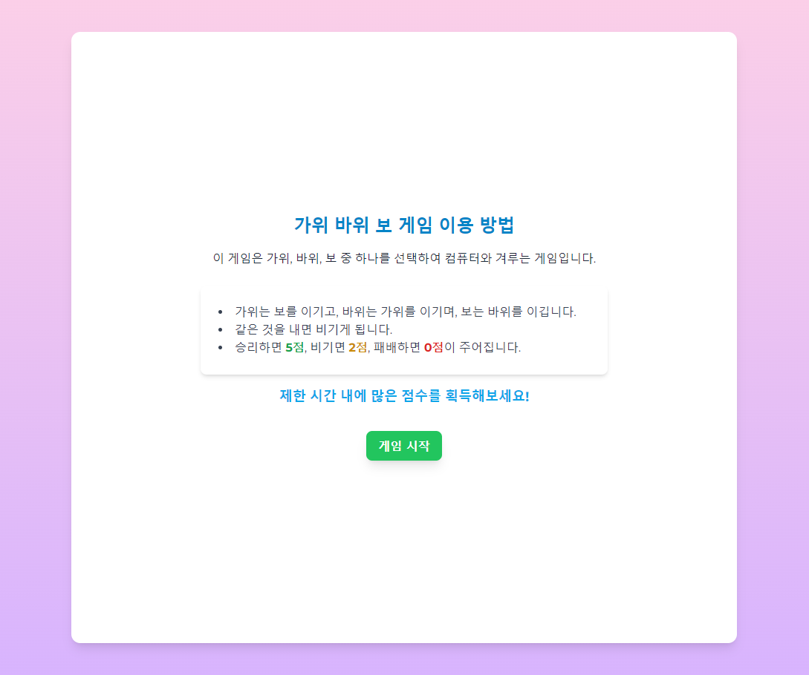
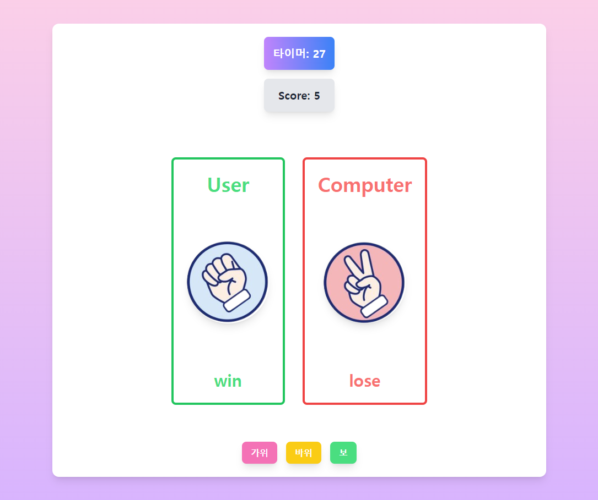

# 가위바위보 게임

## 프로젝트 소개

간단한 웹 기반 가위바위보 게임입니다.

사용자는 가위, 바위, 보 중 하나를 선택하여 컴퓨터와 대결하며, 제한 시간 내에 최대한 많은 점수를 획득하는 것을 목표로 합니다. 이 게임은 React를 사용하여 구현되었습니다.

### 데모 페이지

[여기에서 게임을 확인해보세요!](https://rpsgame-three.vercel.app/)

### 이미지

## 기능

* **게임 시작** : 사용자가 "게임 시작" 버튼을 클릭하면 게임이 시작됩니다.
* **타이머** : 30초의 제한 시간 내에 여러 번의 대결을 통해 점수를 획득합니다.
* **점수 시스템** :
* 승리 시 5점
* 비길 시 2점
* 패배 시 0점
* **모달** : 게임이 종료되면 최종 점수를 보여주는 모달이 나타납니다.

## 사용 기술

* **React** : 사용자 인터페이스를 구성하기 위한 라이브러리입니다.
* **useState** 및  **useEffect** : 상태 관리 및 사이드 이펙트를 처리하기 위해 사용됩니다.

## 게임 로직

1. **게임 시작** : 사용자가 "게임 시작" 버튼을 클릭하면 게임이 시작되며, 타이머가 활성화되고 점수가 초기화됩니다.
2. **타이머 설정** : 게임은 총 30초 동안 진행되며, 이 시간 내에 여러 번의 대결을 통해 점수를 획득합니다.
3. **사용자 선택** : 사용자는 가위, 바위, 보 중 하나를 선택합니다. 선택이 완료되면, 컴퓨터가 랜덤으로 선택한 결과와 비교합니다.
4. **컴퓨터 선택** : 컴퓨터는 가위, 바위, 보 중 하나를 랜덤으로 선택합니다.
5. **결과 판단** : 사용자의 선택과 컴퓨터의 선택을 비교하여 승패를 결정합니다.

* 사용자가 이긴 경우: 점수에 5점을 추가합니다.
* 비긴 경우: 점수에 2점을 추가합니다.
* 패배한 경우: 점수는 변하지 않습니다.

6. **게임 종료** : 30초가 지나게 되면 게임이 종료됩니다. 이때 최종 점수가 모달로 표시됩니다.
